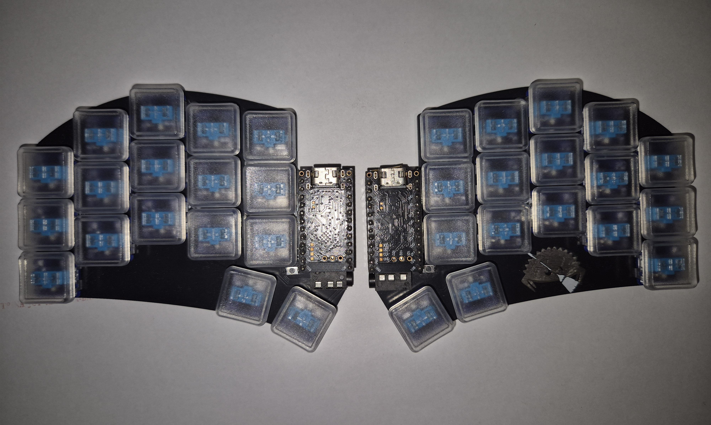

# **Sweep**

???+ Notes

    My main wireless keyboard for coding is this [Sweep](https://github.com/davidphilipbarr/Sweep) also known as the [Ferris](https://github.com/pierrechevalier83/ferris). I use this keyboard because my wrist hurt when editing code in [Lazyvim](https://www.lazyvim.org/) using a normal keyboard. I also liked building this custom keyboard from stratch where I had to buy the part individually and solder, reprogram, and assemble piece by piece.

My keyboard layers is shown below. The keyboard is programmed using [ZMK](https://zmk.dev/) and my custom configuration is [here](https://github.com/kenaniscoding/zmk-sweepp).

## **Sample**

