#  **Undergrad Thesis**
???+ Notes

    _Our group's undergraduate thesis paper is about **Grading and Sorting Carabao Mangoes using Machine Learning**. We did this by getting training and testing our selected CNN model for classifying the ripeness and bruises. We also used computer vision techniques such as OpenCV and thresholding to get the size of the mango._

## **Hardware** 

### Components
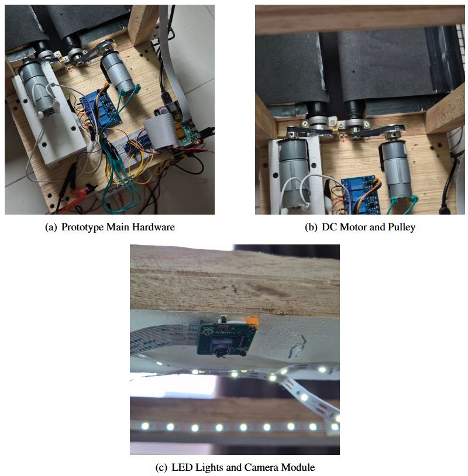

### Prototype View
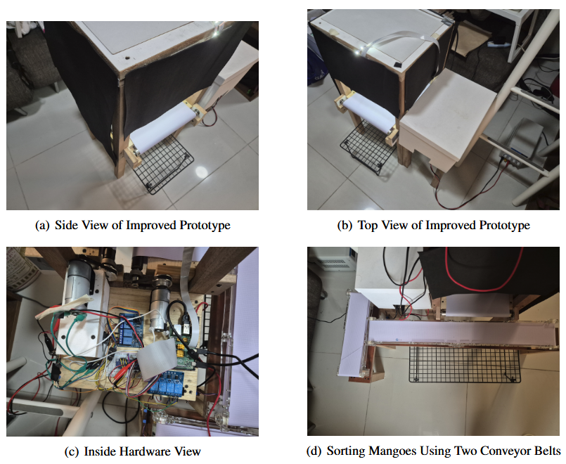

## **Software**

### Raspberry Pi 
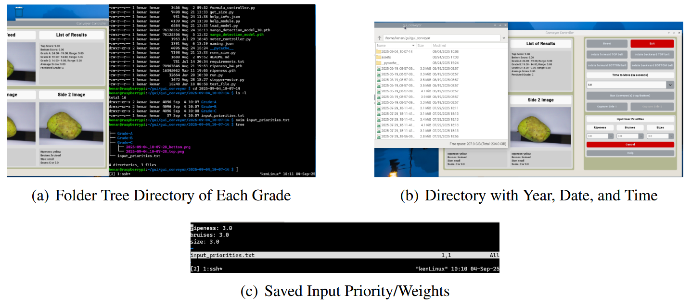

### User Interface
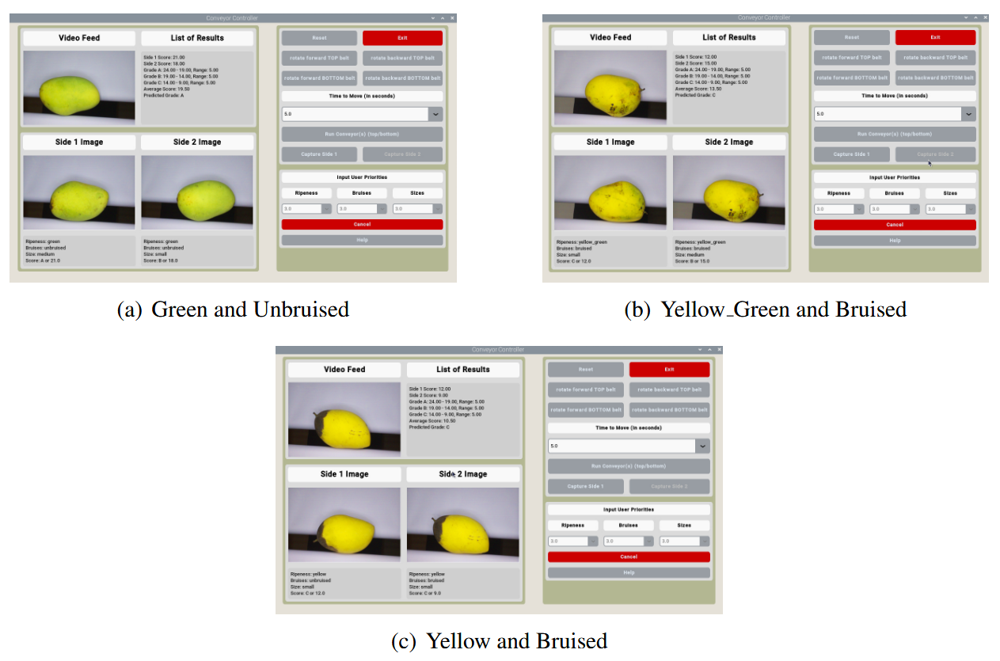

## **Results**

### Ripeness 
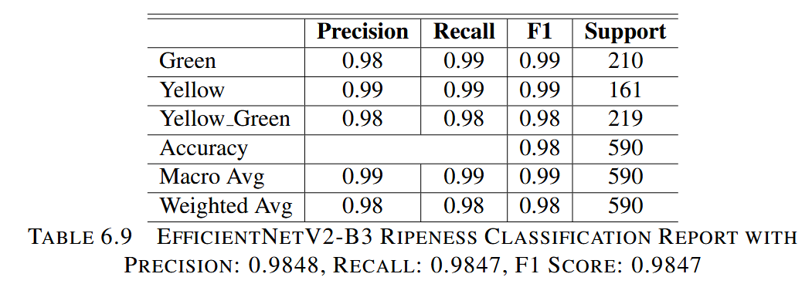
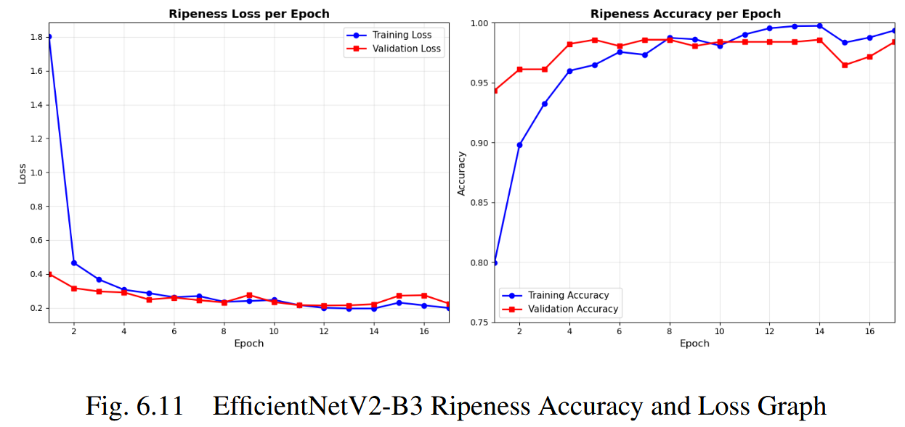

### Bruises 
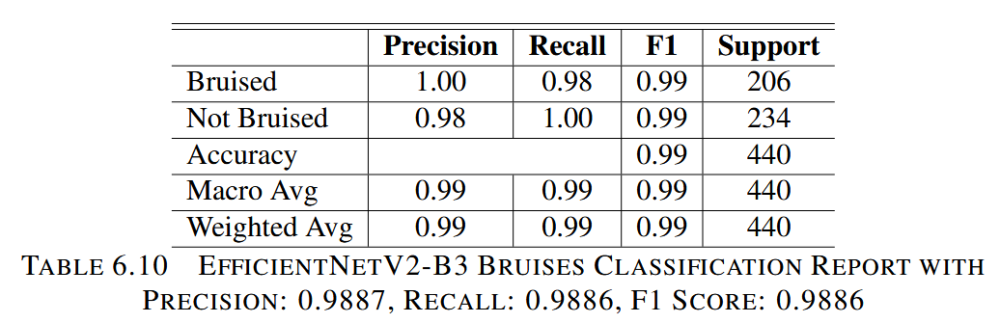
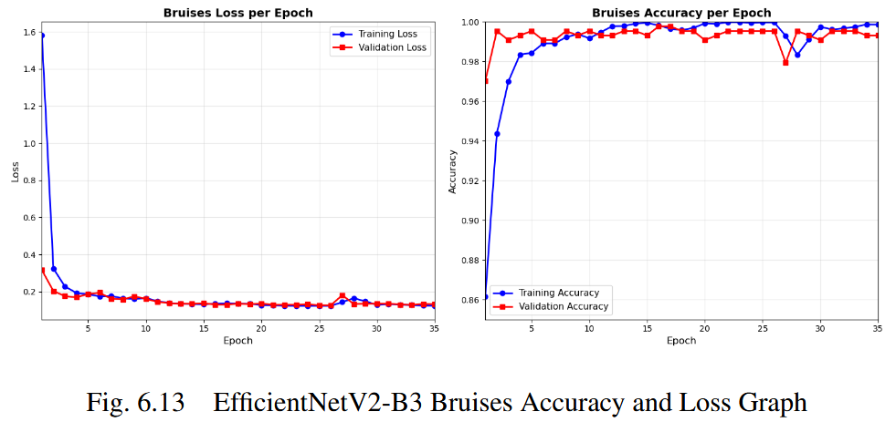

### Size 
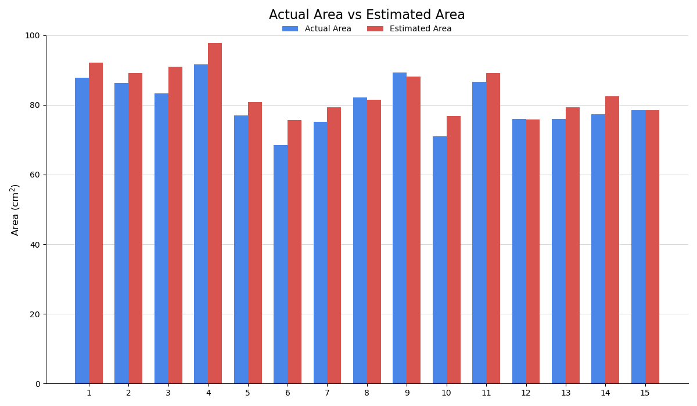
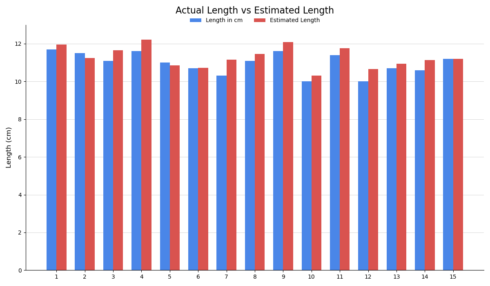
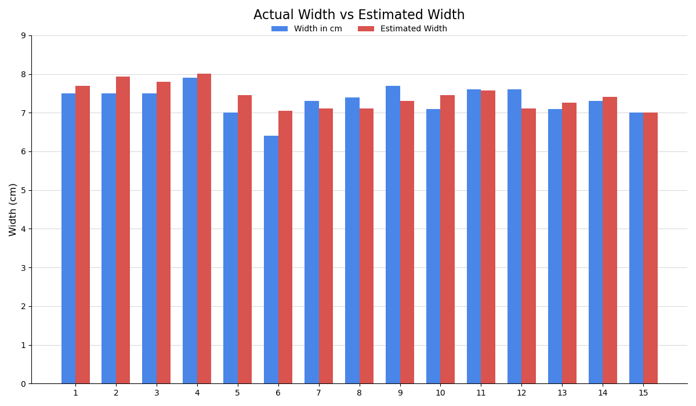

