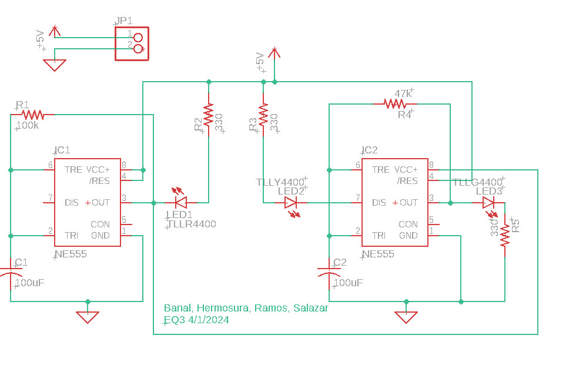
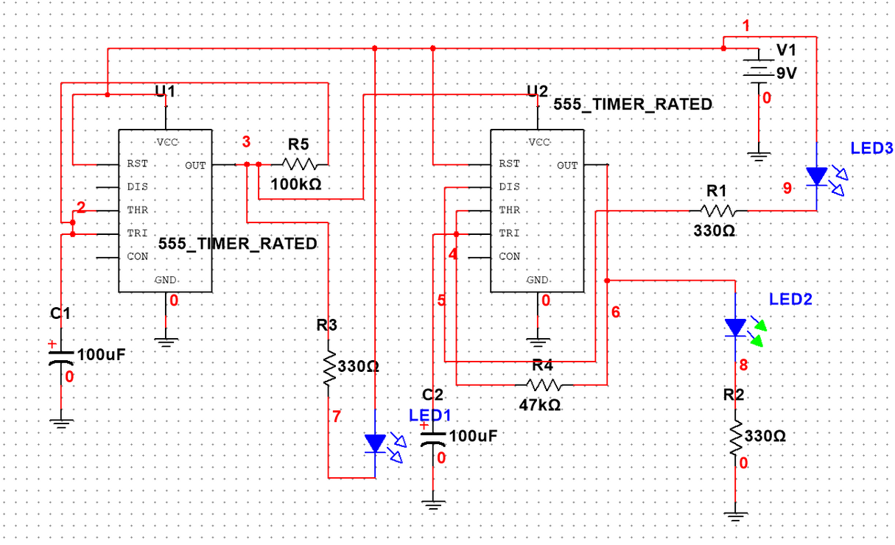
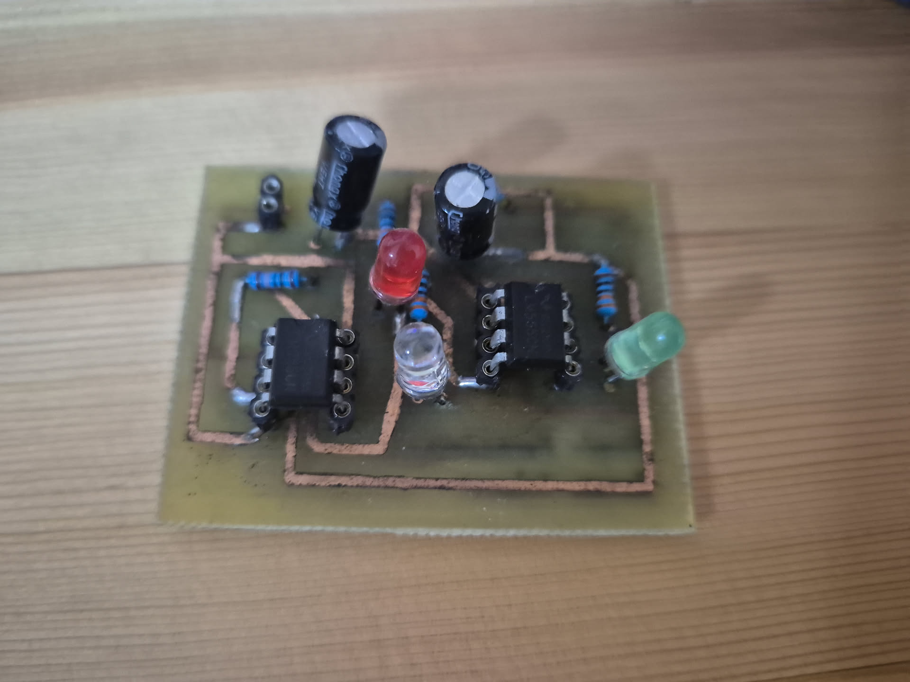
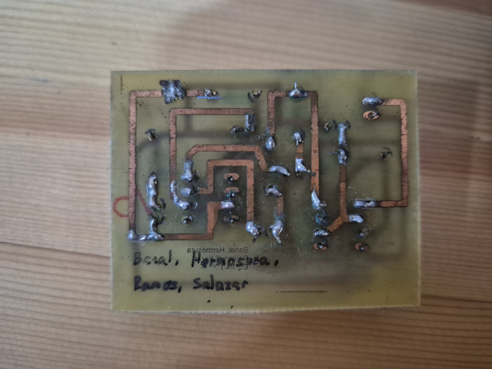
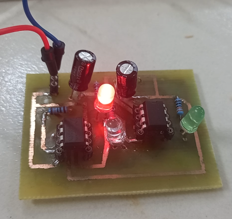
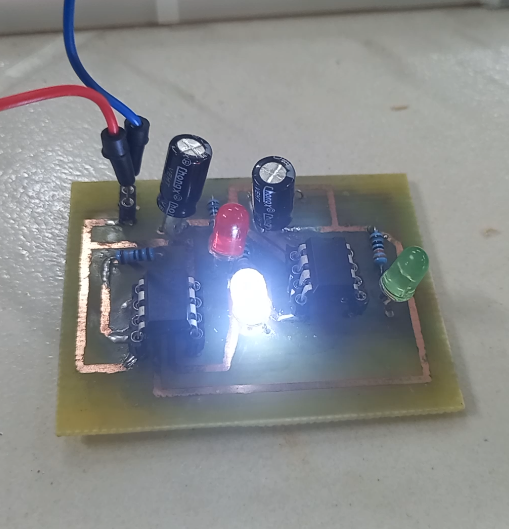
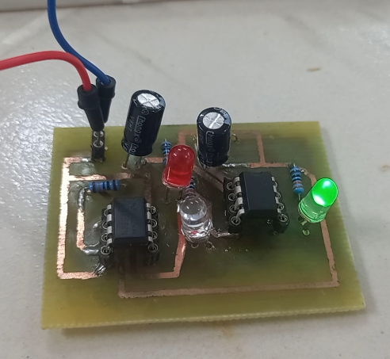
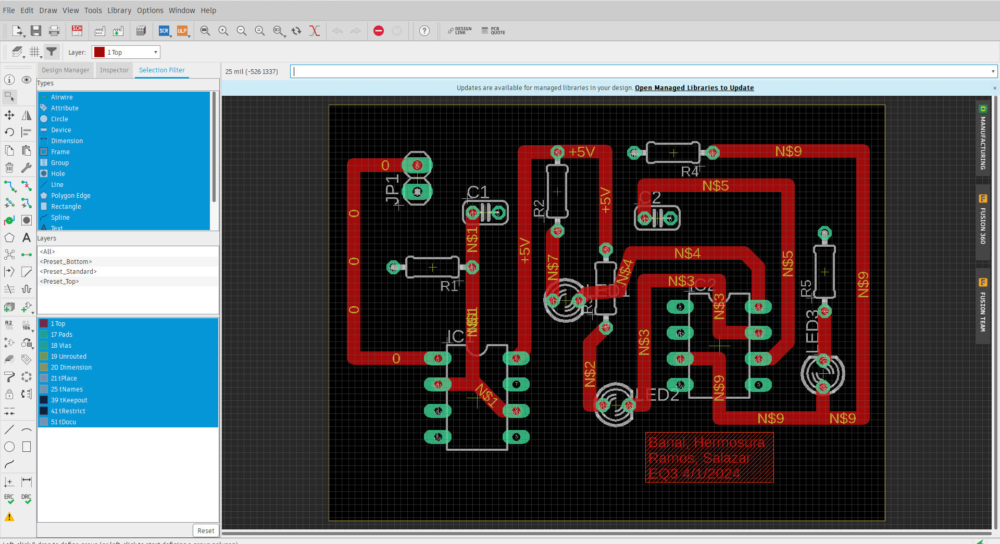
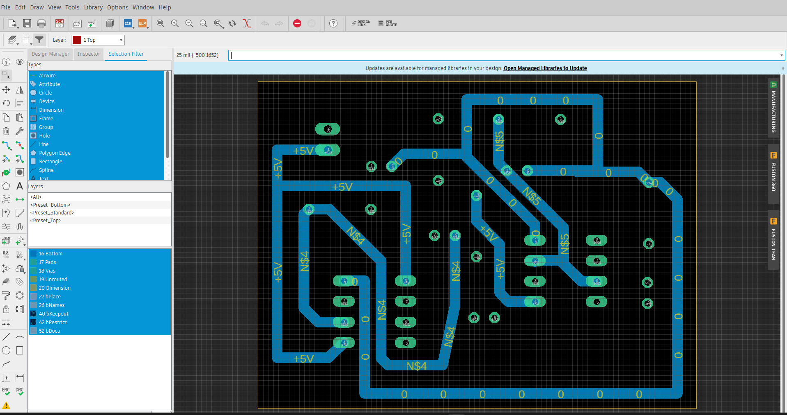

#  **Traffic Light PCB**
This was one of the most unique projects me and my group members have made but also one of the most challenging given the time constrain and our group's first time etching PCB (Printed Circuit Boards).
- 

{width="500"}

#### Shown above is the [existing circuit](https://elonics.org/model-traffic-lights-circuit-using-555-ic/) taken from the internet but was still drawn and tested on [Multisim](https://en.wikipedia.org/wiki/NI_Multisim) as shown below  -

{width="500"}

{width="500"}

#### Shown above and below are the final PCB created by me and my group members

{width="500"}

#### The working circuit is show below

{width="500"}

{width="500"}

{width="500"}

#### The schematic diagram in [Autodesk Fusion](https://www.autodesk.com/asean/products/fusion-360/overview) is shown below

{width="500"}

{width="500"}
